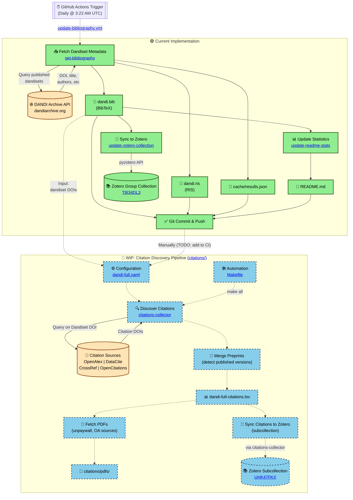

# DANDI Bibliography

Complete bibliography for all published DANDI datasets in BibTeX and RIS formats.

## Statistics

- **Dandisets**: 326
- **Published Versions**: 799
- **Total Records**: 1121 (including "latest" entries)

### Known Issues

3 records failed to fetch valid BibTeX:

- `# No valid BibTeX for 000029/0.230317.1553. Starts with <!DOCTYPE html>`
- `# No valid BibTeX for 000029/0.231017.1955. Starts with <!DOCTYPE html>`
- `# No valid BibTeX for 000029/0.231017.1959. Starts with <!DOCTYPE html>`


## Files

- **dandi.bib**: BibTeX format bibliography
- **dandi.ris**: RIS format bibliography

## Zotero Collection

This bibliography is synchronized to a public Zotero collection:
https://www.zotero.org/groups/5774211/dandi/collections/T8I34DL3

## Citation Keys

Each dataset has two citation keys:
- Versioned: `dandi.000027/0.210831.2033` (specific version)
- Latest: `dandi.000027` (most recent published version)

## Usage

### LaTeX/BibTeX

```latex
\bibliographystyle{plain}
\bibliography{dandi}

Cite as: \cite{dandi.000027/0.210831.2033}
```

### Zotero

Import `dandi.bib` directly into Zotero, or access the public collection above.

## Workflow



### Workflow Details

#### Current Implementation

1. **Daily Automation**: [GitHub Actions workflow](.github/workflows/update-bibliography.yml) runs daily at 3:22 AM UTC
2. **Metadata Fetch**: [`get-bibliography`](code/get-bibliography) queries [DANDI Archive API](https://dandiarchive.org) for all published dandisets
3. **Format Generation**: Creates both [`dandi.bib`](dandi.bib) (BibTeX) and [`dandi.ris`](dandi.ris) (RIS) files
4. **Statistics Update**: [`update-readme-stats`](code/update-readme-stats) updates this README with current counts
5. **Zotero Sync**: [`update-zotero-collection`](code/update-zotero-collection) syncs to [public Zotero group collection](https://www.zotero.org/groups/5774211/dandi/collections/T8I34DL3)
6. **Git Commit**: Changes are automatically committed and pushed to the repository

#### Planned: Citation Discovery Pipeline

The [`citations/`](citations/) directory contains configuration and tooling for discovering citations to DANDI dandisets:

1. **Configuration**: [`dandi-full.yaml`](citations/dandi-full.yaml) points to `dandi.bib` as the source of dandiset DOIs
2. **Citation Discovery**: [citations-collector](https://github.com/con/citations-collector) queries multiple sources:
   - [OpenAlex](https://openalex.org)
   - [DataCite](https://datacite.org)
   - [CrossRef](https://crossref.org)
   - [OpenCitations](https://opencitations.net)
3. **Preprint Merging**: Detects and merges preprint citations with their published versions
4. **Output**: Results saved to [`dandi-full-citations.tsv`](citations/dandi-full-citations.tsv)
5. **PDF Fetching**: Downloads open-access PDFs to [`citations/pdfs/`](citations/pdfs/)
6. **Zotero Subcollection**: Syncs citations to [dedicated subcollection](https://www.zotero.org/groups/5774211/dandi/collections/UHK47FKX)
7. **Automation**: [`Makefile`](citations/Makefile) provides targets for running the pipeline locally or via DataLad

See [`citations/README.md`](citations/README.md) for detailed usage instructions.

## Scripts

Located in `code/`:
- `get-bibliography`: Fetch bibliography from DANDI API
- `update-zotero-collection`: Sync to Zotero collection
- `update-readme-stats`: Update this README with statistics

## License

The bibliography data is derived from DANDI Archive metadata and follows the same licenses as the individual datasets.
